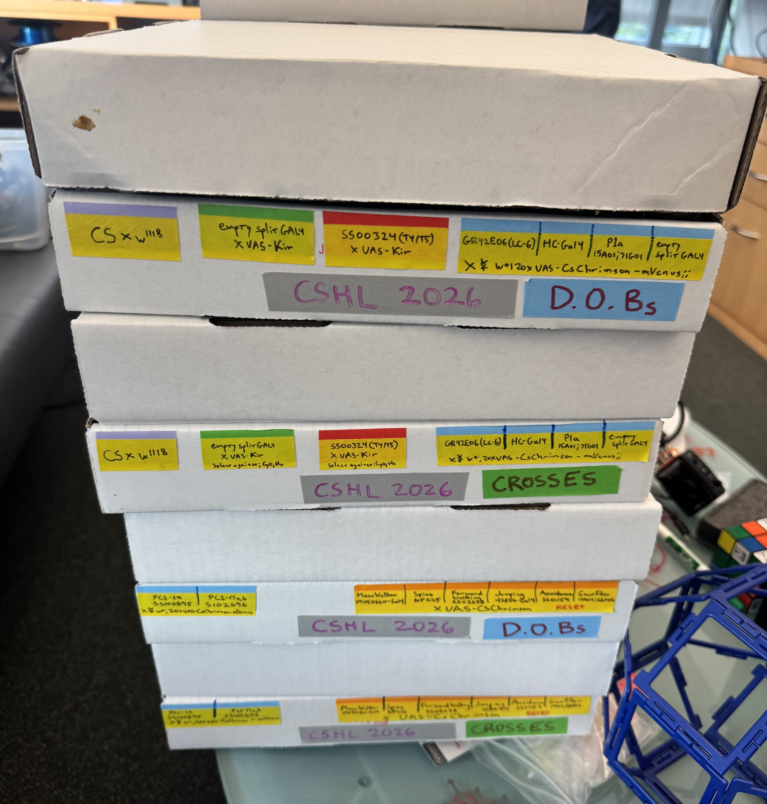

# Fly Stock Genotypes

Use these line shorthand names when entering run metadata in Arena Studio. The
same names appear in the saved run metadata, so they are what you will use later
to group and compare experiments.

The convention is:

```text
driver > effector
```

Parentheses hold the driver or stock identifier when the common name alone is
ambiguous. Sex, food, cross date, and full chromosome-level genotype are not
encoded in the shorthand name; record sex separately in run metadata and use
this document for interpretation.

<div class="image-with-credit">
  
  <span>Flies by Ed Rogers</span>
</div>

## Line Shorthand Names

| Line shorthand | Course use | Sexes available | Food / condition | Cross date | Select against |
| --- | --- | --- | --- | --- | --- |
| `CS x w1118` | Wild type control | F, M | Corn Meal | 18-Jun |  |
| `empty split > Kir2.1` | Silencing control | F | Corn Meal | 18-Jun | Curly, Humeral |
| `T4/T5 (SS00324) > Kir2.1` | Silencing experiment | F | Corn Meal | 18-Jun | Curly, Humeral |
| `empty split > CsChrimson` | Optogenetic activation control | F, M | 1:250 Retinal | 18-Jun | Curly, Humeral |
| `LC-6 (R_42E06) > CsChrimson` | Optogenetic activation | F, M | 1:250 Retinal | 18-Jun |  |
| `P1 (15A01;71G01) > CsChrimson` | Optogenetic activation | M | 1:250 Retinal | 18-Jun |  |
| `Hot Cell (HC-Gal4) > CsChrimson` | Optogenetic activation | F | 1:250 Retinal | 18-Jun |  |
| `pC1_19 (SS100895) > CsChrimson` | Optogenetic activation | M | 1:250 Retinal | 25-Jun |  |
| `pC1_17a,b (SS102696) > CsChrimson` | Optogenetic activation | M | 1:250 Retinal | 25-Jun | Curly |
| `MDN-1 (VT050660) > CsChrimson` | Moonwalker | F, M | 1:250 Retinal | 18-Jun | Humeral |
| `NP225 > CsChrimson` | Spins | F, M | 1:250 Retinal | 18-Jun | Bar (eye) |
| `LC-24 (SS02638) > CsChrimson` | Forward walking | F, M | 1:250 Retinal | 18-Jun |  |
| `Avoidance (SS01159) > CsChrimson` | Avoidance | F, M | 1:250 Retinal | 18-Jun | Humeral |
| `Giant Fiber (17A04-AD;68A06-DBD) > CsChrimson` | Giant fiber | F, M | 1:250 Retinal | 18-Jun |  |
| `none` | No fly / hardware test / metadata placeholder | N/A | N/A |  |

## Selecting flies: markers to avoid

Ed's [current genotype sheet](https://docs.google.com/spreadsheets/d/137YhVIqUZIHw5ivI6FurzA0Xw9QlqHab4Iy3C277J-E/edit?gid=0#gid=0) lists visible markers to **select against** for specific stocks. In other words, choose flies that do **not** show the marker(s) in this table.

| Course line | Select against | Practical reading rule |
| --- | --- | --- |
| `empty split > Kir2.1` | Curly, Humeral | Use flies without Curly wings or Humeral. |
| `T4/T5 (SS00324) > Kir2.1` | Curly, Humeral | Use flies without Curly wings or Humeral. |
| `empty split > CsChrimson` | Curly, Humeral | Use flies without Curly wings or Humeral. |
| `pC1_17a,b (SS102696) > CsChrimson` | Curly | Use flies without Curly wings. |
| `MDN-1 (VT050660) > CsChrimson` | Humeral | Use flies without Humeral. |
| `NP225 > CsChrimson` | Bar (eye) | Use flies without the Bar-eye marker. |
| `Avoidance (SS01159) > CsChrimson` | Humeral | Use flies without Humeral. |

## Full Genotype Reference

### `CS x w1118`

- Wild type control.
- Source list name: `CS X w1118`
- Driver: N/A
- Effector: N/A
- Full genotype fields in sheet: blank
- Sexes: F, M

### `empty split > Kir2.1`

- Silencing control.
- Source list name: `None`
- Driver: `empty split GAL4`
- Effector: `Kir2.1`
- Full driver genotype: `pBPp65ADZp (attP40) ;pBPZpGAL4DBD`
- Full effector genotype: `w+ (DL); +(DL); pJFRC49-10XUAS- eGFPKir2.1(attP2)`
- Sexes: F

### `T4/T5 (SS00324) > Kir2.1`

- Silencing experiment.
- Source list name: `T4/T5`
- Driver: `SS00324`
- Effector: `Kir2.1`
- Full driver genotype: `59E08-p65ADZp(attP40); 42F06-PZpGdbd(attP2)`
- Full effector genotype: `w+ (DL); +(DL); pJFRC49-10XUAS- eGFPKir2.1(attP2)`
- Sexes: F

### `empty split > CsChrimson`

- Optogenetic activation control.
- Source list name: `None`
- Driver: `empty split GAL4`
- Effector: `CsChrimson`
- Full driver genotype: `pBPp65ADZp (attP40) ;pBPZpGAL4DBD`
- Full effector genotype: `w+,20XUAS-CsChrimson-mVenus(attP18);;`
- Sexes: F, M

### `LC-6 (R_42E06) > CsChrimson`

- Optogenetic activation.
- Source list name: `LC-6`
- Driver: `R_42E06`
- Effector: `CsChrimson`
- Full driver genotype: `GMR42E06-Gal4(attP2)`
- Full effector genotype: `w+,20XUAS-CsChrimson-mVenus(attP18);;`
- Sexes: F, M

### `P1 (15A01;71G01) > CsChrimson`

- Optogenetic activation.
- Source list name: `P1`
- Driver: `15A01;71G01`
- Effector: `CsChrimson`
- Full driver genotype: `15A01-p65ADZp(attP40);71G01-ZpGdbd(attP2)`
- Full effector genotype: `w+,20XUAS-CsChrimson-mVenus(attP18);;`
- Sexes: M

### `Hot Cell (HC-Gal4) > CsChrimson`

- Optogenetic activation.
- Source list name: `Hot Cell`
- Driver: `HC-Gal4`
- Effector: `CsChrimson`
- Full driver genotype: `HC-Gal4`
- Full effector genotype: `w+,20XUAS-CsChrimson-mVenus(attP18);;`
- Sexes: F

### `pC1_19 (SS100895) > CsChrimson`

- Optogenetic activation.
- Source list name: `pC1_19`
- Driver: `SS100895`
- Effector: `CsChrimson`
- Full driver genotype: `SS100895`
- Full effector genotype: `w+,20XUAS-CsChrimson-mVenus(attP18);;`
- Sexes: M

### `pC1_17a,b (SS102696) > CsChrimson`

- Optogenetic activation.
- Source list name: `pC1_17a,b`
- Driver: `SS102696`
- Effector: `CsChrimson`
- Full driver genotype: `SS102696`
- Full effector genotype: `w+,20XUAS-CsChrimson-mVenus(attP18);;`
- Sexes: M

### `MDN-1 (VT050660) > CsChrimson`

- Moonwalker.
- Source list note: `Moonwalker`
- Driver: `VT050660-Gal4`
- Effector: `CsChrimson`
- Full driver genotype: `VT050660-Gal4`
- Full effector genotype: `20XUAS-CsChrimson-mVenus(attP18);;`
- Sexes: F, M

### `NP225 > CsChrimson`

- Spins.
- Source list note: `Spins`
- Driver: `NP225`
- Effector: `CsChrimson`
- Full driver genotype: `NP225`
- Full effector genotype: `10XUAS-Chrmson88-tdT`
- Sexes: F, M

### `LC-24 (SS02638) > CsChrimson`

- Forward walking.
- Source list note: `Forward Walking`
- Driver: `SS02638`
- Effector: `CsChrimson`
- Full driver genotype: `SS02638`
- Full effector genotype: `20XUAS-CsChrimson-mVenus(attP18);;`
- Sexes: F, M

### `Avoidance (SS01159) > CsChrimson`

- Avoidance.
- Source list note: `Avoidance`
- Driver: `SS01159`
- Effector: `CsChrimson`
- Full driver genotype: `SS01159`
- Full effector genotype: `20XUAS-CsChrimson-mVenus(attP18);;`
- Sexes: F, M

### `Giant Fiber (17A04-AD;68A06-DBD) > CsChrimson`

- Giant fiber.
- Source list note: `Giant Fiber`
- Driver: `17A04-AD;68A06-DBD`
- Effector: `CsChrimson`
- Full driver genotype: `17A04-AD;68A06-DBD`
- Full effector genotype: `20XUAS-CsChrimson-mVenus(attP18);;`
- Sexes: F, M

## Notes for metadata entry

- Use the line shorthand exactly when possible.
- Record sex separately. Several lines are sex-specific for the planned experiments.
- Use `none` only for no-fly hardware tests, bridge tests, or placeholder metadata.
- If a course run uses a genotype not listed here, ask an instructor what
  shorthand name to use before repeated runs.
